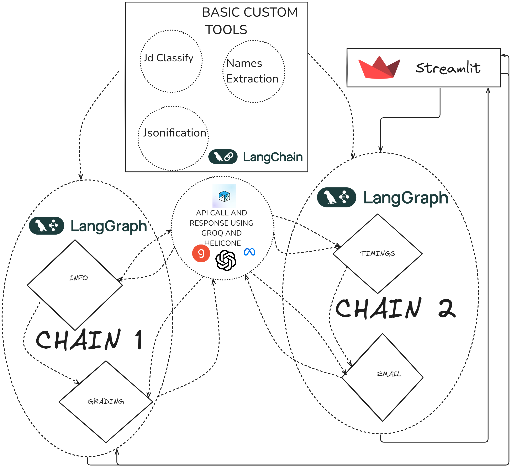

# Resume Shortlister


## Streamlit App in Hugging face
I have provided the resumes and job description that I  have tested in the mentioned folders..
And also I have included the results too.. PLEASE DO LOOK INTO THEM.
 
 URL:
 https://huggingface.co/spaces/Ashish1722/Candidate_Filtering

## HI, THIS IS  A  DEMO VIDEO OF THIS APP>>> I HIGHLYYYYYY RECOMMEND YOU TO GO THORUGH IT.. PLEASE

https://drive.google.com/file/d/1r2VM2_8bRmT84uNgboQJDjbllnnvpvNR/view?usp=sharing

## DEMO VIDEO
[](https://youtube.com/watch?v=toQveRvp6QA)

## Basic Simple workflow

## Important Notes

I have tried by best to derive the proper json from llms through prompt tecchniques and json converting functions.. If still it gives any ERRORS it would either llm not understanding the instructions or being RATE LIMITED. Thank you.

## Overview
Resume Shortlister is a multi-agent AI system designed to analyze resumes, compare them against job descriptions, and identify the best candidates. The system is built using Streamlit for the user interface and LangGraph for state management. It leverages the power of Llama models for natural language processing and OpenAI's API for generating responses.

## Features
- **Batch Processing:** Efficiently processes multiple resumes at once to minimize computational load.
- **Job Description Classification:** Parses and classifies job descriptions to identify key criteria.
- **Resume Analysis:** Extracts and analyzes resume content to assess fitment based on job description.
- **Scoring and Grading:** Assigns scores to candidates based on various criteria such as role match, skillset match, experience match, and educational qualifications.
- **Top Candidate Selection:** Filters the top five candidates based on scores.
- **Email Draft Generation:** Generates personalized email drafts for the top candidates.
- **Timing and Schedule Management:** Sorts and assigns interview timings for shortlisted candidates.

## Installation
1. Clone the repository:
    ```sh
    git clone https://github.com/yourusername/Candidate-filtering-system.git
    cd Candidate-filtering-system
    ```

2. Create a virtual environment and install dependencies:
    ```sh
    python3 -m venv venv
    source venv/bin/activate
    pip install -r requirements.txt
    ```

3. Set up environment variables by creating a `.env` file:
    ```
    GROQ_API_KEY=your_groq_api_key
    HELICONE_API_KEY=your_helicone_api_key
    ```
4. The GROQ is for basic LLM calling where as HELICONE helps us to look into the analytics of the api call
## Usage
1. Run the Streamlit app:
    ```sh
    streamlit run app.py
    ```

2. Upload resumes (in PDF format) and a job description (in PDF format).

3. Enter the timings for the candidates and submit.

## Workflow Explanation
### State Graphs and Nodes
This project uses LangGraph to manage state transitions through two primary workflows:

#### 1. Resume Analysis Workflow
- **Nodes:**
  - `start`: Extracts content from resumes.
  - `end`: Analyzes resumes and scores them based on job descriptions.

- **Functionality:** 
  - The `start` node processes batches of resumes, extracting content and initiating analysis.
  - The `end` node compares resumes against job descriptions, scores them, and updates the DataFrame with analysis results.

#### 2. Email Draft Workflow
- **Nodes:**
  - `timings_sort`: Sorts candidates by score and assigns interview timings.
  - `emails_draft`: Generates personalized email drafts for the top candidates.

- **Functionality:** 
  - The `timings_sort` node sorts candidates by their scores and assigns timings.
  - The `emails_draft` node generates personalized email drafts for the top candidates based on their analysis.

### Process Flow
1. **Resume Information Collection:** Extracts information from uploaded resumes.
2. **Job Description Grading:** Classifies job descriptions and compares them against resumes.
3. **Candidate Filtering:** Filters and ranks the top five candidates based on scores.
4. **Email Draft Generation:** Generates email drafts for the top candidates with personalized content.

## Challenges Faced
- **Computational Load:** Managing the batch processing of resumes to minimize computational overhead.
- **JSON Parsing:** Handling cases where the AI model generates incomplete or incorrect JSON responses.
- **Rate Limiting:** Addressing rate limits imposed by the API services.
- **Continuous Node Execution:** Managing the execution flow of nodes to ensure seamless processing.

## Grading Process
1. **Input Texts:**
   - Extract the provided job description and resume from the input text.
   - Delimit each part using triple backticks for clarity.

2. **Identify Job Description Components:**
   - Parse the job description to extract:
     - **Role:** Job title or primary role.
     - **Skillset:** Specific skills required.
     - **Experience:** Years and type of experience required.
     - **Educational Qualifications:** Required or preferred educational background.

3. **Identify Resume Components:**
   - Parse the resume to extract:
     - **Role:** Current or most recent job title.
     - **Skillset:** Mentioned skills.
     - **Experience:** Years and type of experience.
     - **Educational Qualifications:** Educational background.

4. **Matching Criteria:**
   - Compare each category from the job description with the resume.
   - Assign weightage and scores for each category based on relevance.
   - Provide reasoning for each score.

5. **Generate JSON Output:**
   - Structure the output in JSON format with detailed analysis for each category.

6. **Final Summary:**
   - Summarize the overall match between the job description and resume.
   - Provide an overall score and suitability narrative.

7. **Strengths, Weaknesses, and Risk Areas:**
   - Identify and list the candidate's strengths, weaknesses, and potential risk areas based on the analysis.

8. **Questions:**
   - Generate personalized questions for the candidate based on their profile and the job description.

### Example JSON Output Structure
```json
{
  "role_match": {
    "weightage": 8,
    "score": 90,
    "reasoning": "The candidate's current and previous job titles align well with the role specified in the job description."
  },
  "skillset_match": {
    "weightage": 7,
    "score": 85,
    "reasoning": "The candidate possesses most of the required technical skills, with some minor gaps in specific tools."
  },
  "experience_match": {
    "weightage": 9,
    "score": 95,
    "reasoning": "The candidate has the required years of experience and relevant industry background."
  },
  "education_match": {
    "weightage": 6,
    "score": 80,
    "reasoning": "The candidate's educational background meets the requirements but lacks some preferred certifications."
  },
  "overall_score": 87.5,
  "summary": "The candidate is a strong match for the job role, with relevant experience and skills. The educational background is adequate, though additional certifications could enhance suitability.",
  "strengths": "1. Good communication skills, 2. Proficient in required technology, 3. Team player.",
  "weaknesses": "1. Over-communicates, 2. Gaps in experience with emerging technologies, 3. Challenges with independent decision-making.",
  "risk_areas": "1. Over-reliance on existing skills, 2. Resistance to process changes, 3. Overcommitment leading to burnout.",
  "questions": "1. How do you handle complex ideas communication? 2. How would you combine your tech stacks? 3. Describe a situation where you worked independently."
}
```

## Basic Code Explanation

This document explains the functionality of several Python functions used in a resume processing application.

### 1. Generating Responses using Llama Models (response function)

This function generates responses using the Llama model from OpenAI. 
# Code
```python

def response(message: object, model: object = "llama3-8b-8192", SysPrompt: object = SysPromptDefault, temperature: object = 0.2) -> object:
    """

    :rtype: object
    """
    client = OpenAI(
        api_key=GROQ_API_KEY,
        base_url="https://gateway.hconeai.com/openai/v1",
        default_headers={
            "Helicone-Auth": f"Bearer {HELICONE_API_KEY}",
            "Helicone-Target-Url": "https://api.groq.com"
        }
    )

    messages = [{"role": "system", "content": SysPrompt}, {"role": "user", "content": message}]
    response = client.chat.completions.create(
        model=model,
        messages=messages,
        temperature=temperature,
        frequency_penalty=0.2,
    )
    return response.choices[0].message.content

```
**Parameters:**

* `message`: The input message for which a response is to be generated.
* `model` (optional): The model name to be used (defaults to "llama3-8b-8192").
* `SysPrompt` (optional): The system prompt to guide the response generation (defaults to SysPromptDefault).
* `temperature` (optional): The temperature parameter to control the randomness of the response (defaults to 0.2).

**Functionality:**

1. **Client Initialization:** Initializes the OpenAI client with API keys and default headers.
2. **Message Construction:** Formats the input message and system prompt as a list of messages.
3. **Response Generation:** Uses `client.chat.completions.create` to generate a response based on the specified model, messages, and temperature.
4. **Return Response:** Returns the generated response content.

**Explanation:**

* This function allows generating creative text formats using the Llama model.
* The temperature parameter controls the randomness of the generated response, with higher values leading to more creative but potentially less relevant responses.

### 2. Extracting Content from Resumes (extract_content function)

This function extracts text content from a PDF file:

# Code
```python

def extract_content(pdf_content: bytes) -> List[str]:
    """
    Takes PDF (bytes) and returns a list of strings containing text from each page.
    """
    pdf_doc = fitz.open(stream=pdf_content, filetype="pdf")

    pages_content = []
    for page_number in range(pdf_doc.page_count):
        # Extracting text content
        page = pdf_doc.load_page(page_number)
        text_content = page.get_text("text").replace("\n", "\t")
        pages_content.append(text_content)

    pdf_doc.close()
    return pages_content

```
**Parameters:**

* `pdf_content`: The byte content of the PDF file.

**Functionality:**

1. **Open PDF:** Opens the PDF document using the `fitz` library.
2. **Iterate Pages:** Loops through each page of the PDF.
3. **Extract Text:** Extracts text content from each page using `page.get_text("text")` and replaces newlines with tabs.
4. **Append Text:** Appends the extracted text from each page to a list.
5. **Return Text:** Returns the list containing text content from each page.

**Explanation:**

* This function assumes the resumes are in PDF format and utilizes the `fitz` library for efficient text extraction.

### 3. Batch Processing Resumes (function_info function)

This function processes batches of resumes and generates responses for each batch:

# Code
```python
def function_info(x):
  
     pdf_list = x["messages"]
     model = "llama3-70b-8192"
     batch_size = 3
     all_responses_json = []
     for i in range(0, len(pdf_list), batch_size):
         batch = pdf_list[i:i + batch_size]
         print(f"Processing batch from index {i} to {i + batch_size} ")
         context = "Next file\n\n".join([f"Resume File:\n\n{pdf}\n\n" for pdf in batch])
        
         message = f"RESUMES LIST \n\n{context}\n\n"
         response_json = extract_json(response(message=message, model=model, SysPrompt=resume_prompt))
         all_responses_json.append(response_json)
     
     for response_json in all_responses_json:
      for key,value in response_json.items():
        print(key)
        df["Name"].append(value["name"])
        df["Email id"].append(value["email_id"])
        df["Contact No."].append(value["contact_no"])
        df["Resume_Summary"].append(value["resume_summary"])
     
     x["messages"][-1]= all_responses_json

```

**Parameters:**

* `x`: A dictionary containing a list of PDF resumes in the "messages" key.

**Functionality:**

1. **Batch Processing:** Iterates through the list of resumes in batches of a specified size.
2. **Generate Context:** Concatenates the text content of the resumes in a batch to form the context.
3. **Generate Responses:** Uses the `response` function to generate a response for each batch context.
4. **Extract and Append Information:** Extracts relevant information (name, email, contact number, resume summary) from the response and appends it to a DataFrame (assumed to be defined elsewhere).

**Explanation:**

* This function enables efficient processing of large numbers of resumes by handling them in batches.

** The above is node function in the first graph of agents.  In the same way the batch processing is done for the other nodes as well **

### 4. Classifying Job Descriptions (classify_jd function)

This function classifies a job description and extracts relevant information:

# Code
```python
def classify_jd(job_description):
    model = "llama3-70b-8192"
    message = f"JOB_DESCRIPTION\n\n{job_description}\n\n"
    response_str = response(message=message, model=model, SysPrompt=jd_prompt, temperature=0)
    json_part = extract_json(response_str)
    return json_part

```


**Parameters:**

* `job_description`: The text content of the job description.

**Functionality:**

1. **Generate Message:** Formats the job description for processing.
2. **Generate Response:** Uses the `response` function to generate a response for the job description.
3. **Extract JSON:** Extracts relevant information (presumably classified by the model) from the response string.
4. **Return JSON:** Returns the extracted information as a dictionary.

**Explanation:**

* This function leverages the Llama model to categorize a job description and extract key details.

### Code: Defining and Compiling the Workflow

This code sets up and compiles a state-based workflow using the `StateGraph` class, specifying the sequence of operations for processing resumes and job descriptions.

```python
from langgraph import StateGraph

# Define the workflow
workflow = StateGraph(AgentState)

# Add nodes to the workflow
workflow.add_node("start", function_info)
workflow.add_node("end", function_fitment)

# Define edges between nodes
workflow.add_edge("start", "end")

# Set entry and finish points
workflow.set_entry_point("start")
workflow.set_finish_point("end")

# Compile the workflow
app = workflow.compile()

```
# StateGraph Configuration

```python
# Initialize a new state graph with the AgentState context
StateGraph(AgentState)

# Add a node named "timings_sort" linked to the functions_sort_timings function
add_node("timings_sort", functions_sort_timings)

# Add a node named "emails_draft" linked to the function_email function
add_node("emails_draft", function_email)

# Create a directed edge from the "timings_sort" node to the "emails_draft" node
add_edge("timings_sort", "emails_draft")

# Specify the "timings_sort" node as the entry point of the approach
set_entry_point("timings_sort")

# Specify the "emails_draft" node as the finish point of the approach
set_finish_point("emails_draft")

# Compile the defined approach into an executable application
compile()

```
